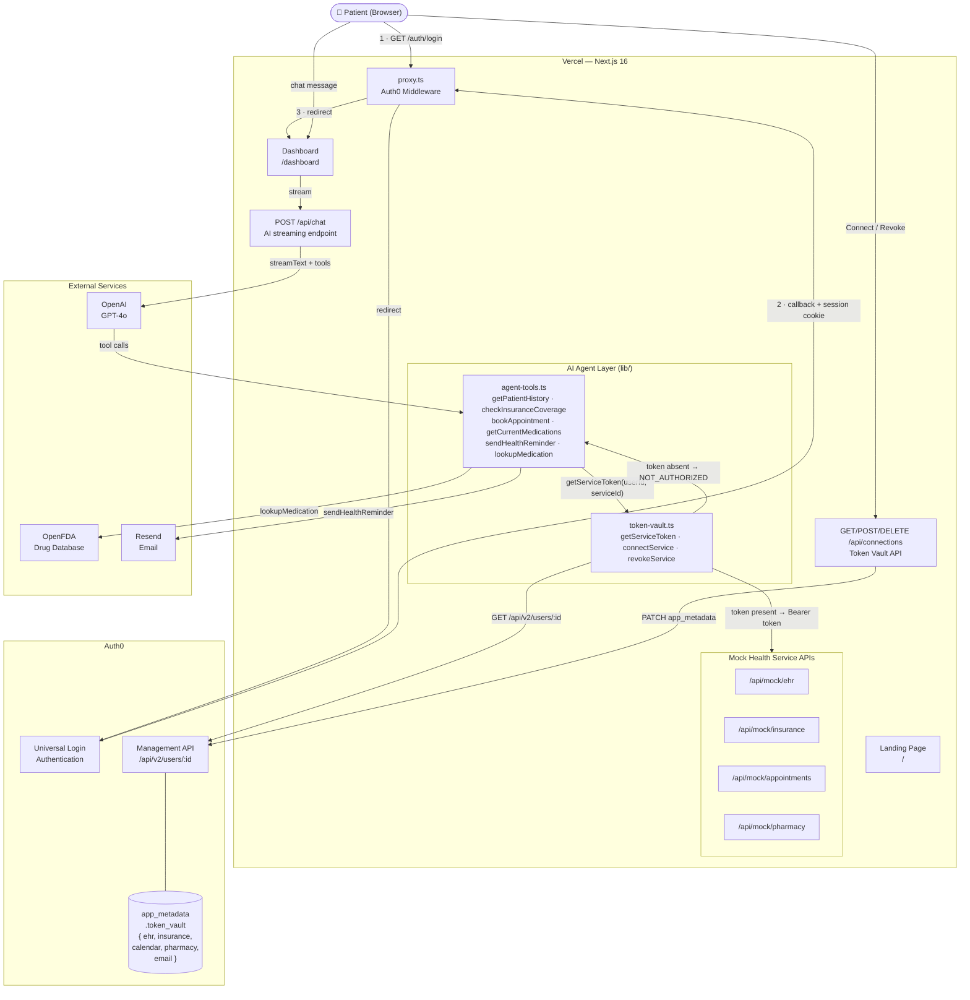
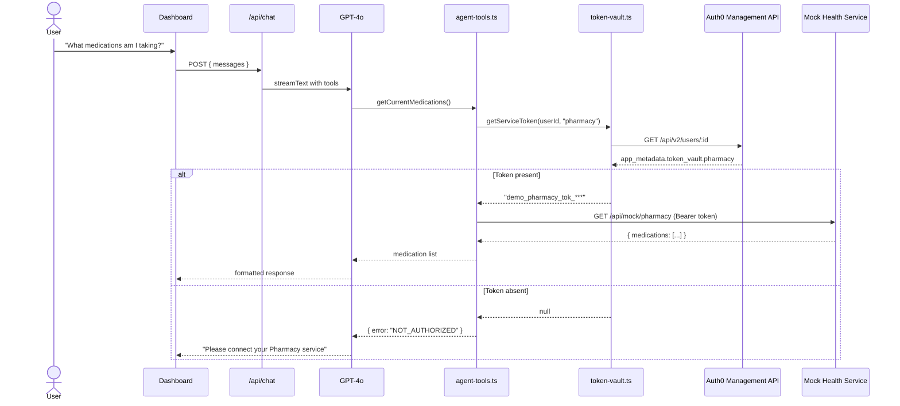

# MediCheck — AI Healthcare Navigator

> Built for the [Auth0 "Authorized to Act" Hackathon](https://authorizedtoact.devpost.com/) 

MediCheck is an AI-powered healthcare navigation assistant that acts on behalf of patients — booking appointments, checking insurance coverage, reviewing medical records, and managing medications — while keeping the patient in complete control of what it can access.

Built on **Auth0 Token Vault** (Auth0 for AI Agents), each connected health service gets its own isolated OAuth token. The AI agent fetches tokens at runtime only when needed, and users can revoke access to any service instantly.

---

## How It Works

1. **Login** with Auth0 — your identity is verified before anything else
2. **Connect services** — choose which health services the agent can access (EHR, insurance, calendar, pharmacy, email). Each gets its own secure token stored in Auth0 Token Vault
3. **Ask in plain English** — "I have knee pain, can I see a specialist?" — the agent handles the rest
4. **Stay in control** — every agent action is logged in the audit trail. Revoke any service connection instantly

---

## Tech Stack

| Layer | Technology |
|---|---|
| Framework | Next.js 16 (App Router, TypeScript) |
| AI Model | GPT-4o (`gpt-4o`) via OpenAI |
| AI SDK | Vercel AI SDK v6 (`ai`, `@ai-sdk/react`, `@ai-sdk/openai`) |
| Authentication | Auth0 (`@auth0/nextjs-auth0` v4) |
| Token Vault | Auth0 for AI Agents (Management API) |
| Styling | Tailwind CSS |
| Email | Resend |
| Medications | OpenFDA public API |
| Deployment | Vercel |

---

## Project Structure

```
medi-agent/
├── app/
│   ├── page.tsx                      # Landing page
│   ├── api/
│   │   ├── chat/route.ts             # AI agent streaming endpoint
│   │   ├── connections/route.ts      # Token Vault connect/revoke API
│   │   └── mock/                     # Mock healthcare service APIs
│   │       ├── ehr/route.ts
│   │       ├── insurance/route.ts
│   │       ├── appointments/route.ts
│   │       └── pharmacy/route.ts
│   └── dashboard/
│       ├── page.tsx                  # Main chat + connections panel
│       └── connections/page.tsx      # Service management page
├── components/
│   ├── chat/                         # Chat UI components
│   └── connections/                  # Service connection UI
├── lib/
│   ├── auth0.ts                      # Auth0Client setup
│   ├── token-vault.ts                # Token Vault helpers (get/connect/revoke)
│   ├── agent-tools.ts                # AI agent tool definitions
│   └── services/                     # Service integrations
│       ├── mock-data.ts              # Demo seed data
│       ├── open-fda.ts               # Real FDA drug database
│       └── resend.ts                 # Email confirmations
├── data/
│   └── demo-patient.json             # Alex Rivera — demo patient profile
├── proxy.ts                          # Auth0 middleware (Next.js 16)
└── types/index.ts
```

---

## Setup

### 1. Clone and install

```bash
git clone <repo>
cd medi-agent
npm install
```

### 2. Configure environment variables

```bash
cp .env.local.example .env.local
```

Edit `.env.local` with your credentials:

```bash
# Auth0 v4 — Regular Web App (AUTH0_DOMAIN is just the domain, no https://)
AUTH0_DOMAIN=your-tenant.auth0.com
AUTH0_CLIENT_ID=
AUTH0_CLIENT_SECRET=
AUTH0_SECRET=                    # openssl rand -hex 32
APP_BASE_URL=http://localhost:3000

# Auth0 M2M — for Token Vault (Management API access)
AUTH0_MGMT_CLIENT_ID=
AUTH0_MGMT_CLIENT_SECRET=

# AI (OpenAI)
OPENAI_API_KEY=

# Email (optional — demo mode works without it)
RESEND_API_KEY=

# App
NEXT_PUBLIC_APP_URL=http://localhost:3000
```

### 3. Configure Auth0

In the [Auth0 Dashboard](https://manage.auth0.com):

**Regular Web App:**
- Allowed Callback URLs: `http://localhost:3000/auth/callback`
- Allowed Logout URLs: `http://localhost:3000`

**M2M Application (for Token Vault):**
- Authorize for the Auth0 Management API
- Required scopes: `read:users`, `update:users`

### 4. Run

```bash
npm run dev
```

Open [http://localhost:3000](http://localhost:3000)

---

## Demo Walkthrough

The app includes a demo patient, **Alex Rivera**, with pre-configured seed data:

- **Conditions:** Type 2 Diabetes, Hypertension
- **Insurance:** BlueCross PPO Gold
- **Primary Care:** Dr. Sarah Chen — City Medical Group

**Happy path demo:**
1. Login → Connect EHR, Insurance, and Calendar services
2. Ask: *"I've been having knee pain, can I see a specialist?"*
3. Agent checks EHR history → verifies insurance coverage → finds orthopedic slots → books appointment → sends confirmation email

**Security demo (Token Vault showcase):**
1. Revoke the Insurance service from the connections panel
2. Ask: *"Is physical therapy covered by my insurance?"*
3. Agent responds: "I can't check your insurance — you need to reconnect it" with a link
4. Reconnect → same question → works immediately

---

## Agent Tools

| Tool | Service | Auth Required |
|---|---|---|
| `getPatientHistory` | EHR Records | Yes — EHR token |
| `checkInsuranceCoverage` | Insurance | Yes — Insurance token |
| `getAvailableAppointments` | Calendar | Yes — Calendar token |
| `bookAppointment` | Calendar + Email | Yes — Calendar + Email tokens |
| `getCurrentMedications` | Pharmacy | Yes — Pharmacy token |
| `lookupMedication` | OpenFDA (public) | No |
| `sendHealthReminder` | Email | Yes — Email token |

Each tool checks Token Vault before executing. If a token is missing or revoked, the agent returns a `NOT_AUTHORIZED` response and prompts the user to connect the service.

---

## System Architecture



## Token Vault Flow



---


## Deployment

```bash
# Deploy to Vercel
vercel deploy
```

Set all environment variables in the Vercel dashboard. Update Auth0 callback/logout URLs to your production domain.

---

## License

MIT
